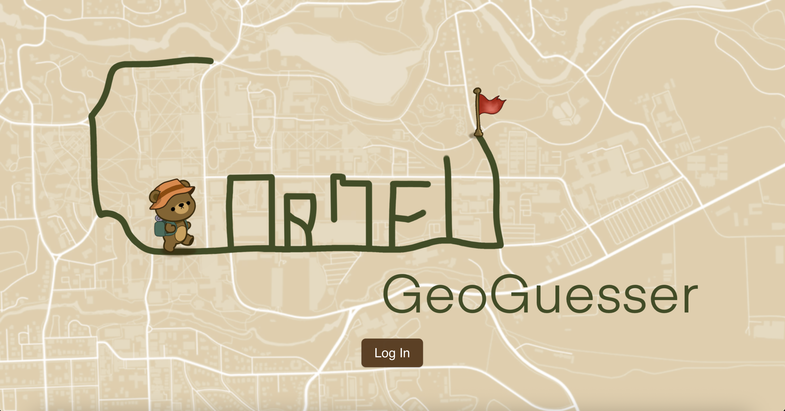
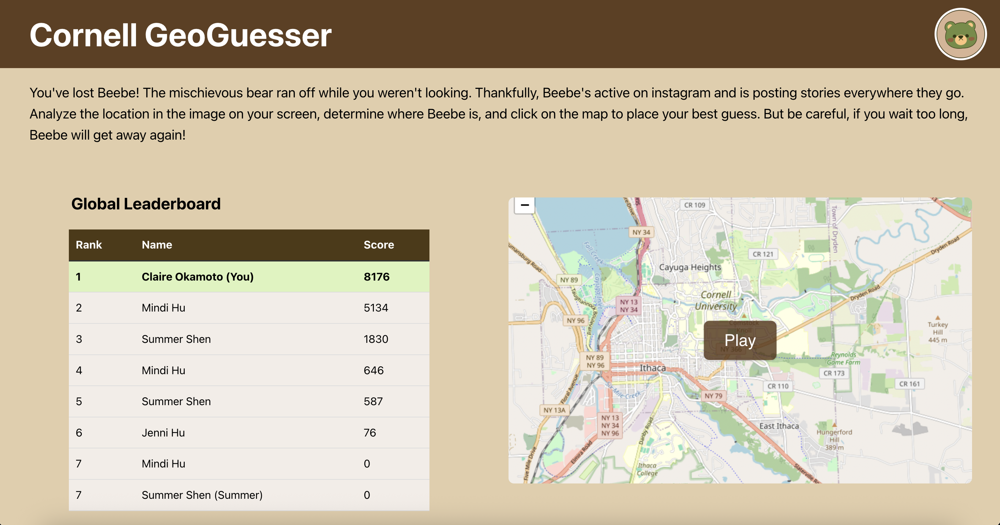
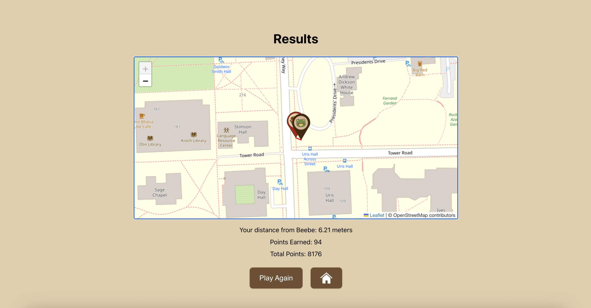
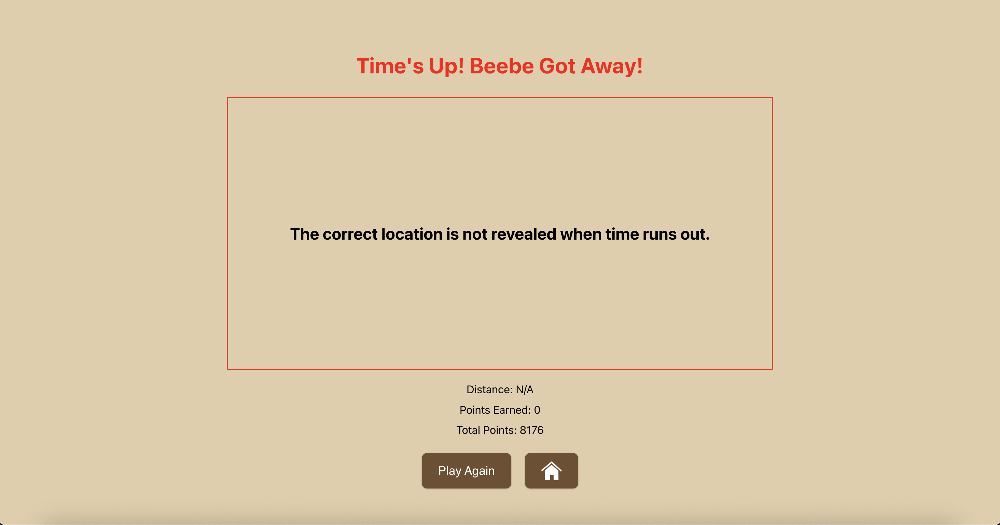
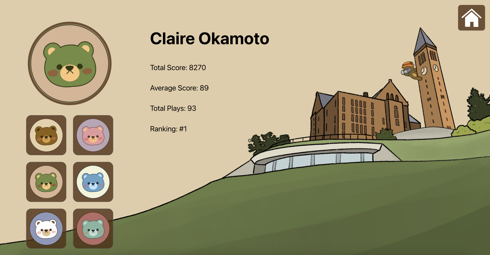

# Cornell GeoGuesser

We created a geoguessr game that has users guess where in Cornell University the generated images are on a map. We implemented this with React, Typescript, Express, Firebase and Leaflet.js, which is an open-source JavaScript library for mobile-friendly interactive maps. 

## Webpages

1. Login page

    

2. Home page

    

3. Game page

    

4. Results page

    
    

5. Profile page

    
